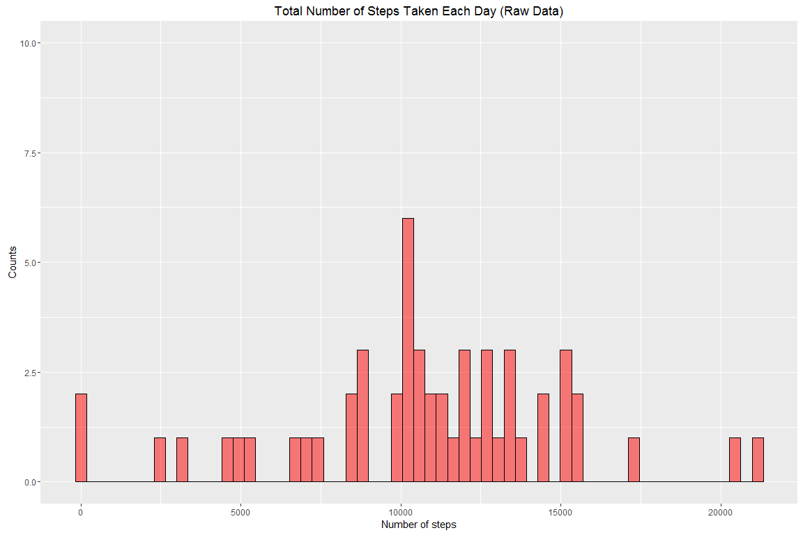
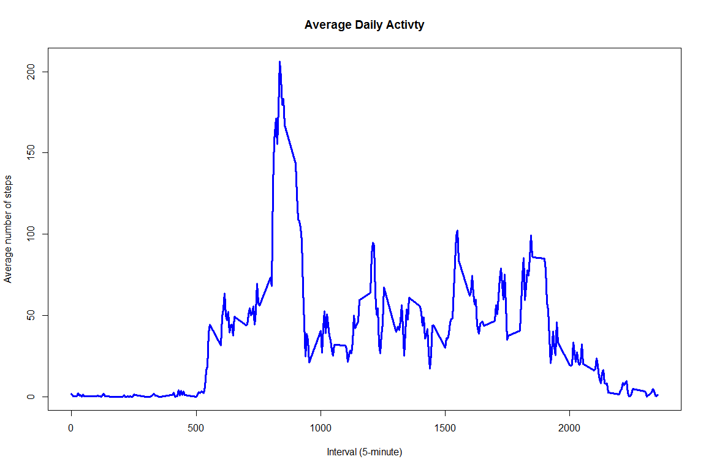
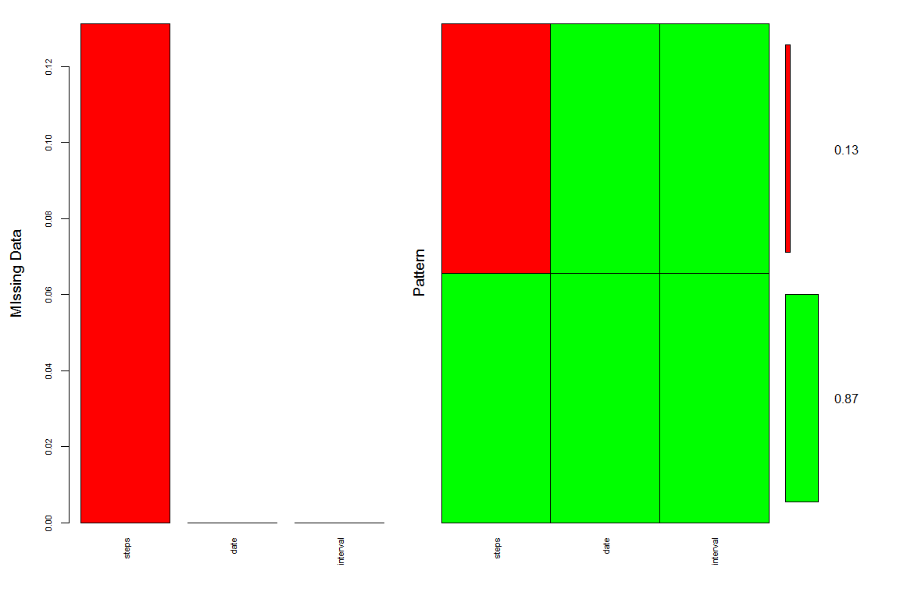
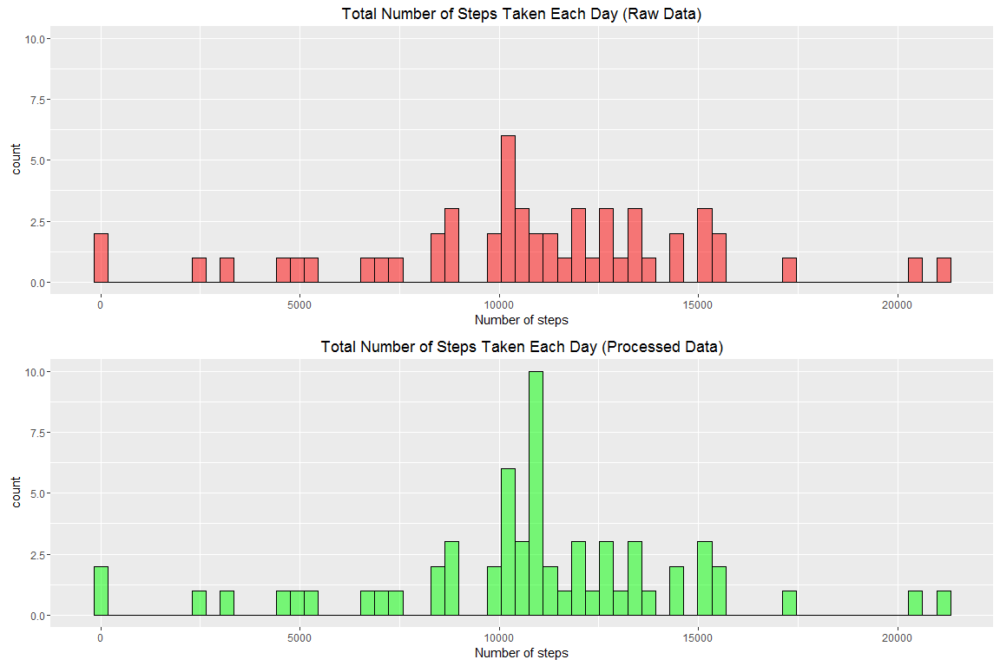
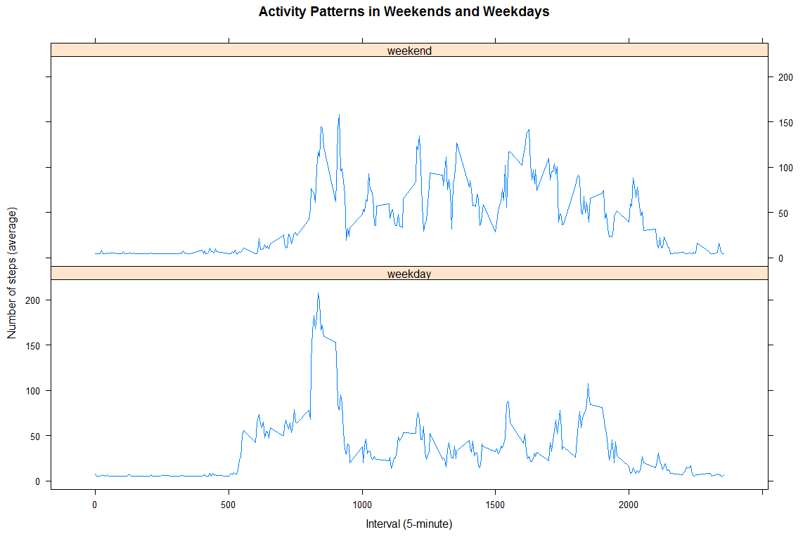

# PA1_template

## Assignment Course Project 1 - Reproducible Research

###Introduction
It is now possible to collect a large amount of data about personal movement using activity monitoring devices
such as a Fitbit, Nike Fuelband, or Jawbone Up. These type of devices are part of the "quantified self" movement
-- a group of enthusiasts who take measurements about themselves regularly to improve their health, to find patterns
in their behavior, or because they are tech geeks. But these data remain under-utilized both because the raw data
are hard to obtain and there is a lack of statistical methods and software for processing and interpreting the data.

This assignment makes use of data from a personal activity monitoring device. This device collects data at 5 minute
intervals through out the day. The data consists of two months of data from an anonymous individual collected during
the months of October and November, 2012 and include the number of steps taken in 5 minute intervals each day.

### Data 
The data for this assignment can be downloaded from the course web site:

* Dataset:  Activity monitoring data [52K]
 
The variables included in this dataset are:
        
* steps: Number of steps taking in a 5-minute interval (missing values are coded as NA)

* date: The date on which the measurement was taken in YYYY-MM-DD format

* interval: Identifier for the 5-minute interval in which measurement was taken

The dataset is stored in a comma-separated-value (CSV) file and there are a total of 17,568 observations in this dataset.

### Program


```r
## Check that directory for download exists
if(!file.exists("data")) { dir.create("data") }

## Check if directory was created
list.files("./data")

## Download file
file_assig <- "https://d396qusza40orc.cloudfront.net/repdata%2Fdata%2Factivity.zip"
download.file (file_assig, destfile = "./data/activity_data.zip")

## Unzip file
unzip("./data/activity_data.zip", exdir = "./data")

## Load file (CVS format)
activity <- read.table ("./data/activity.csv", sep = ",", header = TRUE)
```


```r
library("plyr")

## Calculate total number of steps taken each day
rawsum <- ddply (activity, "date", function(x) 
        { 
        asum <- sum(x$steps)
        data.frame(tsteps=asum)
        })
```

### What is the mean total number of steps taken per day?
#### 1- Make a histogram of the total number of steps each day


```r
library ("ggplot2")
nbins = length(rawsum$date)
ggplot(data = rawsum, aes(rawsum$tsteps)) + 
        geom_histogram(bins = nbins, 
                       col = "black", 
                       fill = "red",
                       alpha = .5) +
        ylim(c(0, 10)) + 
        labs (x="Number of steps", y = "Counts") +
        labs (title= 'Total Number of Steps Taken Each Day (Raw Data)')
```

<!-- -->


#### 2- Calculate and report the mean and median total number of steps taken per day

```r
(rawmeanmedian <- ddply(activity, ~date, summarise,
                        steps_mean = mean(steps, na.rm = TRUE),
                        steps_median = median(steps, na.rm = TRUE)))
```

```
##          date steps_mean steps_median
## 1  2012-10-01        NaN           NA
## 2  2012-10-02  0.4375000            0
## 3  2012-10-03 39.4166667            0
## 4  2012-10-04 42.0694444            0
## 5  2012-10-05 46.1597222            0
## 6  2012-10-06 53.5416667            0
## 7  2012-10-07 38.2465278            0
## 8  2012-10-08        NaN           NA
## 9  2012-10-09 44.4826389            0
## 10 2012-10-10 34.3750000            0
## 11 2012-10-11 35.7777778            0
## 12 2012-10-12 60.3541667            0
## 13 2012-10-13 43.1458333            0
## 14 2012-10-14 52.4236111            0
## 15 2012-10-15 35.2048611            0
## 16 2012-10-16 52.3750000            0
## 17 2012-10-17 46.7083333            0
## 18 2012-10-18 34.9166667            0
## 19 2012-10-19 41.0729167            0
## 20 2012-10-20 36.0937500            0
## 21 2012-10-21 30.6284722            0
## 22 2012-10-22 46.7361111            0
## 23 2012-10-23 30.9652778            0
## 24 2012-10-24 29.0104167            0
## 25 2012-10-25  8.6527778            0
## 26 2012-10-26 23.5347222            0
## 27 2012-10-27 35.1354167            0
## 28 2012-10-28 39.7847222            0
## 29 2012-10-29 17.4236111            0
## 30 2012-10-30 34.0937500            0
## 31 2012-10-31 53.5208333            0
## 32 2012-11-01        NaN           NA
## 33 2012-11-02 36.8055556            0
## 34 2012-11-03 36.7048611            0
## 35 2012-11-04        NaN           NA
## 36 2012-11-05 36.2465278            0
## 37 2012-11-06 28.9375000            0
## 38 2012-11-07 44.7326389            0
## 39 2012-11-08 11.1770833            0
## 40 2012-11-09        NaN           NA
## 41 2012-11-10        NaN           NA
## 42 2012-11-11 43.7777778            0
## 43 2012-11-12 37.3784722            0
## 44 2012-11-13 25.4722222            0
## 45 2012-11-14        NaN           NA
## 46 2012-11-15  0.1423611            0
## 47 2012-11-16 18.8923611            0
## 48 2012-11-17 49.7881944            0
## 49 2012-11-18 52.4652778            0
## 50 2012-11-19 30.6979167            0
## 51 2012-11-20 15.5277778            0
## 52 2012-11-21 44.3993056            0
## 53 2012-11-22 70.9270833            0
## 54 2012-11-23 73.5902778            0
## 55 2012-11-24 50.2708333            0
## 56 2012-11-25 41.0902778            0
## 57 2012-11-26 38.7569444            0
## 58 2012-11-27 47.3819444            0
## 59 2012-11-28 35.3576389            0
## 60 2012-11-29 24.4687500            0
## 61 2012-11-30        NaN           NA
```


### What is the average daily activity pattern?

#### 1- Make a time series plot (.i.e. type = "l") of the 5-minute interval (x-axis) and the average number of steps
#### taken averaged across all days (y-axis)

```r
rawaver <- ddply(activity, ~interval, summarise,
                        meansteps = mean(steps, na.rm = TRUE))
```

```r
plot(rawaver[,1], rawaver[,2], type = "l", col = "blue", lwd = 3, xlab = "Interval (5-minute)", ylab = "Average number of steps", 
     xaxt = "n", 
     main = "Average Daily Activty")
     axis(side=1, at = seq(0, 2500, 500))
```

<!-- -->

#### 2- Which 5-minute interval, on average across all the days in the dataset, contains the maximum number of steps?

```r
IndexMax <- which.max(rawaver[,2])
Interval_MaxNumSteps <- rawaver[IndexMax,1]
AveMaxNumSteps <- rawaver[IndexMax,2]
```
The 5-minute-interval 835 contains the maximum number of steps:206.1698113

### Imputing missing values
#### 1- Calculate and report the total number of missing values in the dataset (i.e. the total number of rows with NA's)

```r
## Review pattern of NA's in dataset 
library ("mice")
md.pattern(activity)
```

```
##       date interval steps     
## 15264    1        1     1    0
##  2304    1        1     0    1
##          0        0  2304 2304
```


```r
library ("VIM")
## Plot missing data and pattern of missing data in file
## the "x-axis" represent the columns in the file
mice_plot <- aggr(activity, col=c("green", "red"), 
                  numbers = TRUE,
                  sortVars = TRUE,
                  labels = names(activity),
                  cex.axis = 0.7,
                  gap = 3,
                  ylab = c("MIssing Data", "Pattern"))
```

<!-- -->

```
## 
##  Variables sorted by number of missings: 
##  Variable     Count
##     steps 0.1311475
##      date 0.0000000
##  interval 0.0000000
```


```r
## Calculate total number of missing values
tna <- sum( is.na(activity$steps) )
```

Total number of missing values: 2304

#### 2. Devise a strategy for filling in all of the missing values in the dataset. The strategy does not need to be 
####    sophisticated.For example you coud use the mean/median for that day, or the mean for that 5-minute interval, etc.

"impute" from library "Hmisc" will be used for this purpose

#### 3- Create a new dataset that is equal to the original dataset but with the missing data filled in.


```r
library (Hmisc)
activity2 <- activity
activity2$steps <- with(activity2, impute(steps, mean))
```

#### 4- Make a histogram of the total number of steps taken each day and calculate and report the mean and median total number of steps take per day. 
#### Do these values differ from the estimates from the first part of the assignment?
#### What is the impact of imputig missing data on the estimates of the total daily number of steps?


```r
library("ggplot2")
library("gridExtra")

## Total number of steps
## (Calculate total number of steps taken each day using the dataset with the imputted values)
procsum <- ddply (activity2, "date", function(x) 
{ 
        bsum <- sum(x$steps) 
        data.frame (tsteps = bsum)
})

nbins = length(procsum$date)

hraw <- ggplot(data = rawsum, aes(rawsum$tsteps)) + 
        geom_histogram(bins = nbins, 
                       col = "black", 
                       fill = "red",
                       alpha = .5) + 
        ylim(c(0, 10)) + 
        xlab ("Number of steps") +
        ggtitle ('Total Number of Steps Taken Each Day (Raw Data)') 

hproc <- ggplot(data = procsum, aes(procsum$tsteps)) + 
        geom_histogram(bins = nbins, 
                       col = "black", 
                       fill = "green",
                       alpha = .5) + 
        ylim(c(0, 10)) +
        xlab ("Number of steps") +
        ggtitle ('Total Number of Steps Taken Each Day (Processed Data)')

grid.arrange(hraw, hproc, nrow = 2)
```

<!-- -->


```r
## Mean and median total number of steps
(procmeanmedian <- ddply(activity2, ~date, summarise,
                        steps_mean = mean(steps, na.rm = TRUE),
                        steps_median = median(steps, na.rm = TRUE)))
```

```
##          date steps_mean steps_median
## 1  2012-10-01 37.3825996      37.3826
## 2  2012-10-02  0.4375000       0.0000
## 3  2012-10-03 39.4166667       0.0000
## 4  2012-10-04 42.0694444       0.0000
## 5  2012-10-05 46.1597222       0.0000
## 6  2012-10-06 53.5416667       0.0000
## 7  2012-10-07 38.2465278       0.0000
## 8  2012-10-08 37.3825996      37.3826
## 9  2012-10-09 44.4826389       0.0000
## 10 2012-10-10 34.3750000       0.0000
## 11 2012-10-11 35.7777778       0.0000
## 12 2012-10-12 60.3541667       0.0000
## 13 2012-10-13 43.1458333       0.0000
## 14 2012-10-14 52.4236111       0.0000
## 15 2012-10-15 35.2048611       0.0000
## 16 2012-10-16 52.3750000       0.0000
## 17 2012-10-17 46.7083333       0.0000
## 18 2012-10-18 34.9166667       0.0000
## 19 2012-10-19 41.0729167       0.0000
## 20 2012-10-20 36.0937500       0.0000
## 21 2012-10-21 30.6284722       0.0000
## 22 2012-10-22 46.7361111       0.0000
## 23 2012-10-23 30.9652778       0.0000
## 24 2012-10-24 29.0104167       0.0000
## 25 2012-10-25  8.6527778       0.0000
## 26 2012-10-26 23.5347222       0.0000
## 27 2012-10-27 35.1354167       0.0000
## 28 2012-10-28 39.7847222       0.0000
## 29 2012-10-29 17.4236111       0.0000
## 30 2012-10-30 34.0937500       0.0000
## 31 2012-10-31 53.5208333       0.0000
## 32 2012-11-01 37.3825996      37.3826
## 33 2012-11-02 36.8055556       0.0000
## 34 2012-11-03 36.7048611       0.0000
## 35 2012-11-04 37.3825996      37.3826
## 36 2012-11-05 36.2465278       0.0000
## 37 2012-11-06 28.9375000       0.0000
## 38 2012-11-07 44.7326389       0.0000
## 39 2012-11-08 11.1770833       0.0000
## 40 2012-11-09 37.3825996      37.3826
## 41 2012-11-10 37.3825996      37.3826
## 42 2012-11-11 43.7777778       0.0000
## 43 2012-11-12 37.3784722       0.0000
## 44 2012-11-13 25.4722222       0.0000
## 45 2012-11-14 37.3825996      37.3826
## 46 2012-11-15  0.1423611       0.0000
## 47 2012-11-16 18.8923611       0.0000
## 48 2012-11-17 49.7881944       0.0000
## 49 2012-11-18 52.4652778       0.0000
## 50 2012-11-19 30.6979167       0.0000
## 51 2012-11-20 15.5277778       0.0000
## 52 2012-11-21 44.3993056       0.0000
## 53 2012-11-22 70.9270833       0.0000
## 54 2012-11-23 73.5902778       0.0000
## 55 2012-11-24 50.2708333       0.0000
## 56 2012-11-25 41.0902778       0.0000
## 57 2012-11-26 38.7569444       0.0000
## 58 2012-11-27 47.3819444       0.0000
## 59 2012-11-28 35.3576389       0.0000
## 60 2012-11-29 24.4687500       0.0000
## 61 2012-11-30 37.3825996      37.3826
```

### Are there differences in activity patterns between weekdays and weekends?
#### For this part the "weekdays() function may be of some help here. Use the dataset with the filled-in missing values for this part.

#### 1- Create a new factor variable in the dataset with two levels "weekday" and "weekend" indicating whether a given date is a weekday or weekend day


```r
## Create a column with the day obtained from the column "date"
activity2$day <- weekdays(as.Date(activity2$date))

## Define the days that correspond to weekends
weekends <- c("Saturday", "Sunday")

## Create a column with a factor that describes whether the column of the day created above is a weekday or a weekend 
activity2$dayofweek <- factor((activity2$day %in% weekends),
                              levels = c(FALSE, TRUE), labels=c("weekday", "weekend"))
```

#### 2- Make a panel plot containing a time series plot (i.e. type = "l") of the 5-minute interval (x-axis) and the 
####    average number of steps taken, averaged across all weekday days or weekend days (y-axis). 


```r
procaver <- ddply(activity2, dayofweek~interval, summarise,
                  meansteps = mean(steps, na.rm = TRUE))


xyplot(meansteps ~ interval | dayofweek , data = procaver, layout = c(1,2),
       type = "l",
       xlab = "Interval (5-minute)",
       ylab = "Number of steps (average)",
       main = "Activity Patterns in Weekends and Weekdays")
```

<!-- -->
